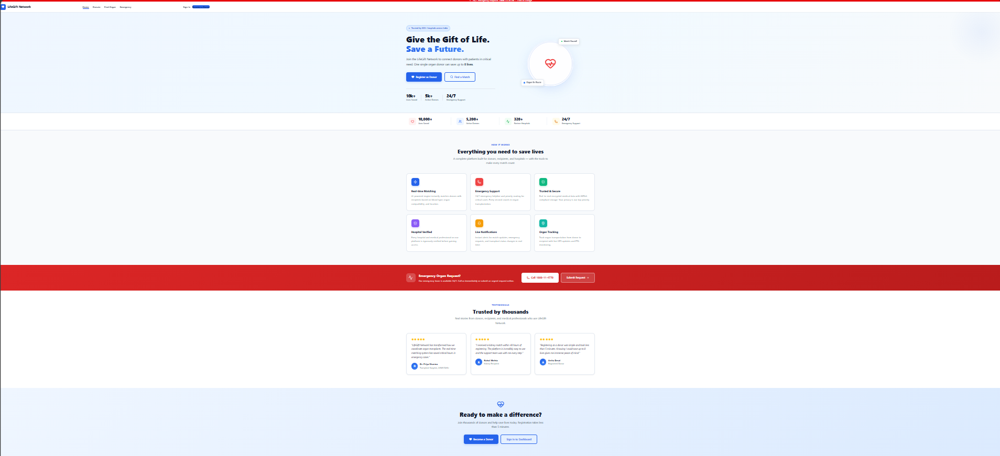
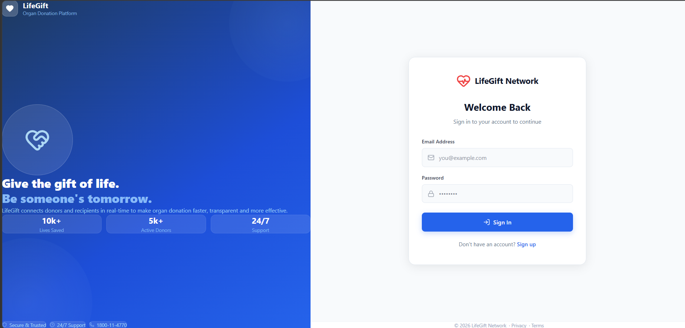
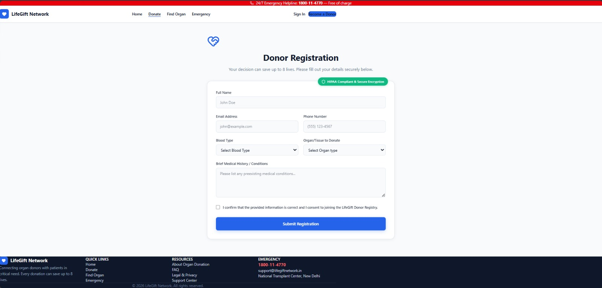
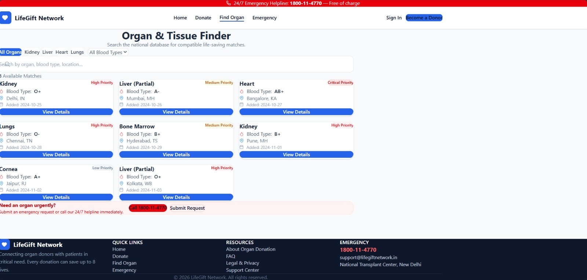
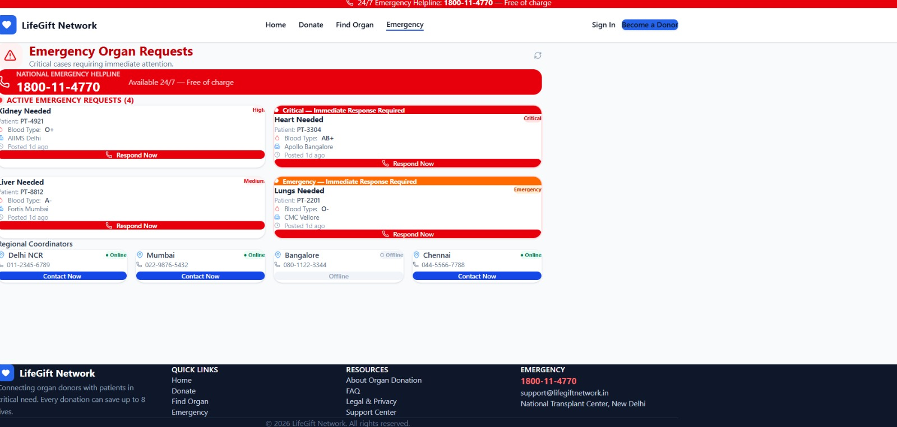

# LifeGift Network - Organ Donation and Sharing Platform

A premium healthcare SaaS platform connecting organ donors with recipients in real-time.
Built with React, Vite, TailwindCSS, and Supabase.

---

## Live Demo

https://oragan-donation-and-sharing-network-526fazl5v.vercel.app

---

## Screenshots

### Home Page

### Login Page

### Donor Registration

### Find Organ

### Emergency Requests

---

## Features

- Real-time Organ Matching
- Role-based Dashboards (Donor, Receiver, Hospital, Admin)
- Emergency Request System with live alerts
- Live Notifications via Supabase Realtime
- Advanced Search and Filters
- Secure Authentication with role-based access
- Admin Control Panel
- Fully Responsive Design

---

## Tech Stack

| Layer | Technology |
|-------|------------|
| Frontend | React 18 + Vite |
| Styling | TailwindCSS + Custom CSS |
| Backend | Supabase (PostgreSQL) |
| Auth | Supabase Auth |
| Realtime | Supabase Realtime |
| Deployment | Vercel |
| Icons | Lucide React |
| Font | Inter (Google Fonts) |

---

## Setup

1. Clone the repo
2. Run npm install
3. Copy .env.example to .env and add Supabase credentials
4. Run SQL files in Supabase: supabase_matching.sql, supabase_notifications.sql, supabase_fix.sql
5. Run npm run dev

---

## Team

| Name | Role | GitHub |
|------|------|--------|
| Gauri Nikam | UI/UX Designer and Project Lead | @Missgauri |
| Vaibhav Jaiswal | Backend and Supabase Integration | @jaiswalvaibhav019 |
| Pragati Dolas | Frontend Development | @pragatidolas |
| Jana | Testing and Documentation | @badejana |

---

Made with love to save lives. All rights reserved 2026 LifeGift Network.
